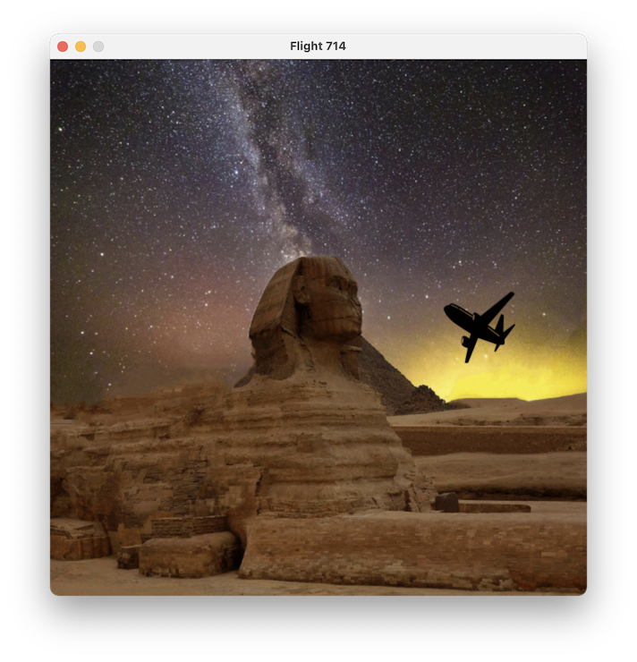

# Python Pygame Exercises

This repository contains exercises and small games created using **Pygame** as part of a learning process. The projects included are **Telebolito** (a Pong-style game), **Flight 714** (a simple flight movement simulation) and **Colibrí** (a flappy bird-style game).

## 🚀 Projects Included


### **1️⃣ Telebolito** 
A classic **Pong-style** game where you control a paddle, and the computer controls the other. The goal is to bounce the ball and score points against the AI opponent.


### **2️⃣ Flight 714**
A simple game where you control an airplane, moving it around the screen while keeping it within boundaries.


### **3️⃣ Colibrí**
A Flappy-Bird game where you keep the bird in the air with the space bar. Try not to hit the pipes and enjoy the Colombian mountains lanscape 😊


### **4️⃣ Tragamonedas 💰**
A Pac-Man bird game, collect all the coins and the wallet once it is full to join the cryto-queens ₿.


## 📌 Installation
Make sure you have **Python 3.x** installed. Then, follow these steps:

1. **Clone the repository**
   ```bash
   git clone https://github.com/your-username/python-game.git
   cd python-game
   ```
2. **Set up a virtual environment**
   ```bash
   python3 -m venv venv
   source venv/bin/activate  # On macOS/Linux
   venv\Scripts\activate  # On Windows
   ```
3. **Install dependencies**
   ```bash
   pip install -r requirements.txt
   ```

## 🕹️ How to Run the Games

#### **Run Telebolito**
```bash
python3 telebolito.py
```
#### **Run Flight 714**
```bash
python3 flight714.py
```
#### **Run Colibrí**
```bash
python3 colibri.py
```

#### **Run Tragamonedas 💰**
```bash
python3 tragamonedas.py
```

## 🎮 Controls
#### **Telebolito (Pong-Style Game)**
- **⬆️ UP Arrow**: Move paddle up
- **⬇️ DOWN Arrow**: Move paddle down

#### **Flight 714 (Plane Movement)**
- **⬅️ LEFT Arrow**: Move left
- **➡️ RIGHT Arrow**: Move right
- **⬆️ UP Arrow**: Move up
- **⬇️ DOWN Arrow**: Move down

#### **Colibrí (Flappy Bird-Style Game)**
- **␣ SPACE**: Move bird up

#### **Tragamonedas 💰 (Pac-Man Style Game)"**
- **⬅️ LEFT Arrow**: Move Developer left
- **➡️ RIGHT Arrow**: Move Developer right
- **⬆️ UP Arrow**: Move Developer up
- **⬇️ DOWN Arrow**: Move Developer down

## 📷 Image Attribution
The following images are used in the games:
- **Desert Background** (`desert.jpg`): Photo by Pixabay from Pexels - [The Great Sphinx](https://www.pexels.com/photo/the-great-sphinx-262786/).

- **Airplane Image** (`airplane.png`): Icon by Jule & Matthias Steffen from the Noun Project - [Airplane](https://thenounproject.com/icon/airplane-5096/).

- **Colombian Mountains** (`colibri_landscape.png`): Photo by Chris Rodriguez from Pexels - [Tall Tress on the Mountain Ranges](https://www.pexels.com/photo/tall-trees-on-the-mountain-ranges-2884864/).

- **Colibrí** (`colibri_pixelate.png`): Pixel art based on the **Colombia Emplumada II** book cover photo by Juan Diego Castillo Ramírez - [Get the book](https://www.librerialerner.com.co/colombia-emplumada-ii-9789584874597-4090/p?srsltid=AfmBOorkkfUfNjfyKWA7GM6L7ai1O3FhO8YZ61lfYC5xIJBB5uDNkiI_).

- **Server Background** (`ai-generated-9088888_1280.jpg`) Image by [kp yamu Jayanath](https://pixabay.com/users/yamu_jay-44818947/?utm_source=link-attribution&utm_medium=referral&utm_campaign=image&utm_content=9088888) from [Pixabay](https://pixabay.ckcom//?utm_source=link-attribution&utm_medium=referral&utm_campaign=image&utm_content=9088888").

- **Bitcoin** (`bitcoin.png`)Image by [Nurdin Bekkeldiev](https://pixabay.com/users/odinzero-43301353/?utm_source=link-attribution&utm_medium=referral&utm_campaign=image&utm_content=8976961) from [Pixabay](https://pixabay.com//?utm_source=link-attribution&utm_medium=referral&utm_campaign=image&utm_content=8976961).

- **Credit Card** (`banking-4318911_640.png`)Image by [Alistair Whyte](https://pixabay.com/users/whyteali-306823/?utm_source=link-attribution&utm_medium=referral&utm_campaign=image&utm_content=4318911) from [Pixabay](https://pixabay.com//?utm_source=link-attribution&utm_medium=referral&utm_campaign=image&utm_content=4318911).

- **Hacker** (`hacker.png`) Image by [Henning](https://pixabay.com/users/hnnng-15965496/?utm_source=link-attribution&utm_medium=referral&utm_campaign=image&utm_content=5151533) from [Pixabay](https://pixabay.com//?utm_source=link-attribution&utm_medium=referral&utm_campaign=image&utm_content=5151533).

- **Developer Image** (`developer.png`) by [@anaya83](https://www.freepik.com/author/anaya83) from [Freepik](https://www.freepik.com/premium-vector/concentrated-ethnic-female-freelancer-using-laptop_368738734.htm#fromView=user&page=1&position=0).

## 🎶 Music + Sounds Attributions
- Music by [Gaston A-P](https://pixabay.com/users/xtremefreddy-32332307/?utm_source=link-attribution&utm_medium=referral&utm_campaign=music&utm_content=150676) from [Pixabay](https://pixabay.com//?utm_source=link-attribution&utm_medium=referral&utm_campaign=music&utm_content=150676).

- Coin Sound Effect by [Driken Stan](https://pixabay.com/users/driken5482-45721595/?utm_source=link-attribution&utm_medium=referral&utm_campaign=music&utm_content=236671) from [Pixabay](https://pixabay.com//?utm_source=link-attribution&utm_medium=referral&utm_campaign=music&utm_content=236671).-

- Woosh slide-in Sound Effect by [freesound_community](https://pixabay.com/users/freesound_community-46691455/?utm_source=link-attribution&utm_medium=referral&utm_campaign=music&utm_content=88642) from [Pixabay](https://pixabay.com//?utm_source=link-attribution&utm_medium=referral&utm_campaign=music&utm_content=88642)

- Game Over Sound Effect by [Ribhav Agrawal](https://pixabay.com/users/ribhavagrawal-39286533/?utm_source=link-attribution&utm_medium=referral&utm_campaign=music&utm_content=230470) from [Pixabay](https://pixabay.com//?utm_source=link-attribution&utm_medium=referral&utm_campaign=music&utm_content=230470)

- Winning Sound Effect by [Universfield](https://pixabay.com/users/universfield-28281460/?utm_source=link-attribution&utm_medium=referral&utm_campaign=music&utm_content=144751) from [Pixabay](https://pixabay.com//?utm_source=link-attribution&utm_medium=referral&utm_campaign=music&utm_content=144751)

## 🛠️ Features & Future Improvements
✅ Randomized ball movement direction in Telebolito  
✅ AI-controlled paddle movement  
✅ Speed increases after a set number of points  
✅ Player-controlled airplane movement in Flight 714  

### 🔜 Planned Improvements:
- Implement scoring UI for Telebolito
- Add sound effects to both games
- Improve AI paddle movement strategy
- Implement more realistic physics for Flight 714

## 🤝 Contributing
Feel free to fork this repository and submit pull requests with improvements!

## 📜 License
This project is licensed under the **MIT License**.

---
